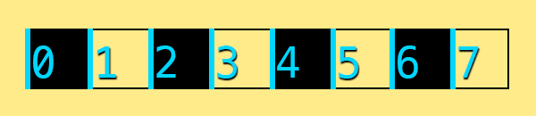

# Customize the game Speed Maze

Speed maze is a game about navigating a maze as quickly as you can.
We'll add the ability to track the amount of time it takes to run the maze
and maybe a pause button.

## Getting the source code

Download the [source code][corona-source-zip] and save it to your mobile games
folder.

Unzip the folder and open the Corona Simulator. Using the File > Open menu,
select the `main.lua` from speedmaze-corona-master. Use Command + Shift + O on Mac OS
or Control + Shift + O on Windows to open the `main.lua` file in Brackets. The
code is also available with an explanation on [this web page][annotated].

## Looking familiar?

Speedmaze uses the same basic grid system as robotfindskitten. There are a few
big changes though. We swapped the *x* and *y* coordinate because it's much
more natural to write lists of rows than lists of columns. If I had
thought ahead more, I would have made robotfindskitten use rows first just
like this game. You will see `[y][x]` instead of `[x][y]` from now on!

Run the maze a few times just for fun.

## Moving the maze goal

The maze goal is set on line 48. Move it somewhere else using the maze
coordinate system.

## Adding a stopwatch timer

We've already played with event listeners when we set up the controls for
robotfindskitten. We use the same controls for speedmaze too. However, we're
now going to use an event listener to build a stopwatch object that 
displays the amount of time it takes you to run the maze. This is going to
be our first feature that *you* build from scratch! Are you excited?

### Side Quest: Corona SDK documentation

Up to this point, you've seen very little of the Corona SDK itself, and have
written plain Lua for 90% of the things we've done. When you have used the
Corona SDK, it was in predetermined methods that you copied. But that isn't
going to be the case from here on out. We're about to write a major feature
from scratch using Corona's `timer` library. To do that, it'll help to know
more about the library. Every good tool you will ever use as a programmer has
some good documentation behind it. The documentation for Corona SDK is on the
website <http://docs.coronalabs.com>. The documentation for the games you write
in this course is the [annotated source code][annotated] along with the 
lab section worksheets. Reading the entire Corona SDK manual can be
tedious, which is why programmers often treat documentation as "reference"
material. Meaning that instead of reading it all cover to cover, they
search for the parts that they think will help them. Reading things cover to
cover can be fun because you learn the full extend of what is possible.
Tonight we are just going to refer to the timer section of the
documentation.

### Creating a stopwatch object

Above the definition of the `play()` and after the playButton around line 487
create a new stopwatch object.

```lua
local stopwatch = {}
```

### Give it a clock

We'll create a clock counter that starts at 0.0.

```lua
stopwatch.clock = 0.0
```

### Display the watch time.

Create some text that will display the time on the watch.

```lua
stopwatch.displayText = display.newText(stopwatch:formatClock(), 100, 700,
	native.systemFont, 48)
```

### Our clock must tick

Now we need to create a function that runs each time the watch "ticks". We'll
call it `increment` since it will increase the counter and update the
display each tick of the watch.

Note that this function is *not* a method. We have to name the
stopwatch exactly instead of using the method style with a `watch` as a first
argument. There are ways around this, but they overcomplicate things. Maybe
we'll explore them in the future.

```lua
stopwatch.increment = function(timerData)
	stopwatch.clock = stopwatch.clock + 1
	stopwatch.displayText.text = stopwatch:formatClock()
end
```

### Write a method that starts the stopwatch.

Now it's time to use the Corona SDK. Check out the documentation for
[timers](http://docs.coronalabs.com/api/library/timer/index.html) to get an
explanation of the functions we'll need for our stopwatch.

We use the perform with delay library function from Corona to have Corona call
us when the timer runs out. We've set the timer to run ever 1000 milliseconds.
A millisecond is 1/1000th of a second so if we wait 1000 1/1000ths of a second
we wait exactly one second. Say that 10 times fast. We tell Corona to "call us"
by running our watch increment function. The last 0 is the argument that tells
Corona how many times to re-run the timer. By sending a zero we tell Corona to
run forever.

Since this function is going to call us when the time runs out. So what does it
return *right now*? It returns a timer ID number that we can use to stop the
timer later. We need to save this so we can stop the timer when the player's
runner crosses the finish line.

```lua
stopwatch.start = function(watch)
	watch.timer = timer.performWithDelay(100, watch.increment, 0)
end
```

### Write a method that stops the stopwatch

Now we need to stop the stopwatch when the runner finishes the maze. We can do
that by cancelling the timer. Once we do that, the timer will stop and our
increment function will no longer be called to update the watch.

```lua
stopwatch.stop = function(watch)
	timer.cancel(watch.timer)
end
```

### Make sure we can reset the watch

All we have left to do is make sure we can reset the watch. to do so. We just
set the clock back to zero and update the display.

```lua
stopwatch.reset = function(watch)
	watch.clock = 0
	watch.displayText.text = watch:formatClock()
end
```

### Updating the game methods to use the stopwatch.

Three things need to occur to integrate this stopwatch into our game. Instead of
showing you the way, I've left it for you to figure out how to do it using the
existing stopwatch methods and game functions. If you get stuck, don't be afraid
to ask for help. I got stuck a ton writing this game and got help from my
friends.

Here's what we need to do:

* Reset the stopwatch when we start the game
* Start the stopwatch when we start playing and show the controls
* Stop the stopwtach when the player finishes the maze

## Adding a pause feature

Can you create a Pause button that shows above the controls? I've helped you out
by writing a plan.

### Write stopwatch:pause() and stopwatch:resume methods

You'll need to use the `timer.pause(timerId)` and `timer.resume(timerId)` to
write stopwatch pause and resume methods which we can use for our game's main
pause and resume functions.

### Write pause() and resume() stub functions

Now we can write "stub" functions for pause and resume. They won't do
everything we intend our pause and resume to do. For now they just need to
pause and resume the stopwatch.

### Create a pauseButton

Using the startButton as a template, create a pause button that sits above the
control pad. I did this by adding `- 2.5 * controlCenterRadius` to the *y*
coordinates of the pause button and button text.

Set the touch event listener to call the global `pause()` function that we set
up and hide the pause button.

### Create an unpauseButton

No do the same again! We have so many buttons, soon we're going to need a
library for making them! This time create an unpause button that (can you guess)
calls the `unpause()` global function. I prefer this button to stay in the same
place as the others, but you could put it where the pause button is as well.

### Finalizing our pause(), unpause(), and start() functions

Remember those stub functions we created earlier. It's time to populate them.

`pause()` should:
* hide the pause button (handled by the touch event handler)
* show the unpause button
* pause the stopwatch
* hide the controls

`unpause()` should:
* hide the unpause button (handled by the touch event handler)
* show the pause button
* resume the stopwatch
* show the controls

Lastly, when we start the game, we need to make sure our `start()` function
hides the unpause button and shows the pause button.

## Creating your own mazes

Now that you've seen the default maze you can have fun creating your own. Go to
town on the maze just as it is, or create a second maze, then perhaps a third.
Modify the random code from robotfindskitten to choose a random maze when the
game starts. If you want the maze to change each time you hit the play again
button, you'll need to extract the code from line 204 to 212 into a new
for loop that runs at the start of the play function. Then you can change the
maze between games.

### Side Quest: Why do computers count funny?

If you read the source code to speedmaze, you may have noticed something a bit
odd. Our maze starts counting at 1, but we told our grid to start counting at 0.
Also, most other computer languages you work with start counting at 0. Time
for a quick vocabulary lesson:

* *zero indexed*: We say that a program or language that starts counting at 0 is zero indexed.
* *one indexed*: We say that a program or language that starts counting at 1 is one indexed.

*Don't worry. There aren't any two indexed or three indexed languages. That would
be ridiculous.*

Historically, all computer languages are zero indexed because of the way
computers count. This is best illustrated with a chess board.


You and I might count the squares, moving square by square like this:


The first square is one, then two, three, and so on...

Computers do it differently though. Computers move *line by line* and count
the number of squares that they've passed.



At the first line, there's been no squares yet. At the second there has been
a single square. At the next line there's been a third and then it stops at
the last line having counted seven squares and ready for the final one. But
it stops there because if it got to the last line, there'd be no square to
follow it.

[corona-source-zip]: https://github.com/nuclearsandwich/speedmaze-corona/archive/master.zip
[annotated]: http://nuclearsandwich.com/speedmaze-corona/docs/main.html
